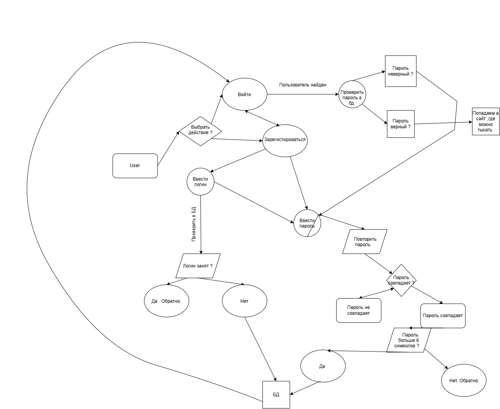

# FastAPI JWT Auth

Простой REST API с регистрацией и авторизацией через JWT.

## Стек
- Python 3.11
- FastAPI
- JWT (PyJWT)
- PostgreSQL (или SQLite, если на нём)

## Как запустить
1. Установить зависимости: `pip install -r requirements.txt`
2. Запустить: `uvicorn main:app --reload`
3. Открыть документацию: `http://localhost:8000/docs`

## Эндпоинты
- `POST /register` — регистрация нового пользователя
- `POST /login` — получение JWT-токена
- `GET /protected` — защищённый маршрут (требуется токен)

  
Процесс регистрации и входа пользователя описан в BPMN-схеме:

### Что происходит на схеме:
1. Пользователь выбирает действие: "Войти" или "Зарегистрироваться".
2. При регистрации:
   - Вводит логин - проверка, свободен ли он.
   - Вводит пароль - повторяет пароль → проверка совпадения.
   - Проверка длины пароля (минимум 6 символов).
   - Если всё верно - данные сохраняются в БД.
3. При входе:
   - Вводит логин и пароль.
   - Система проверяет их в БД.
   - Если пароль неверный - возврат к вводу.
4. В случае успеха - пользователь попадает на главный экран.
